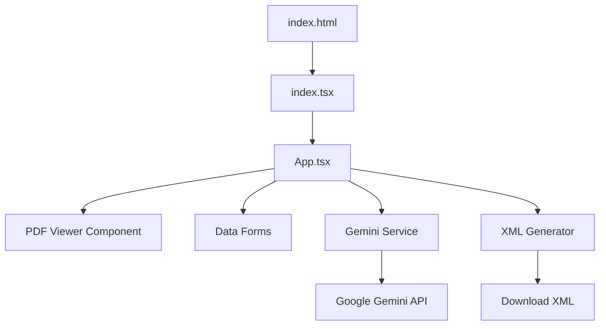
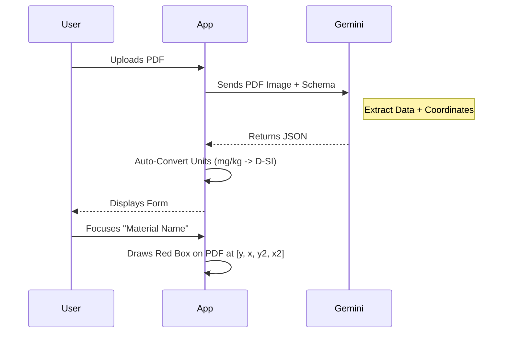

# Digital Reference Material Generator (DRMD)

A React-based web application that leverages **Google's Gemini 2.5 Flash** (Vision) to extract structured data from Reference Material Certificates (PDFs) and generate machine-readable XML documents.

## 🌟 Overview

This tool streamlines the digitization of Reference Material Documents. Instead of manually typing data from certificates into XML files, users can:
1.  **Upload** a PDF certificate.
2.  **Analyze** the document using AI to extract text, tables, metadata, and *coordinates*.
3.  **Review** the extracted data in a form with **interactive PDF highlighting**.
4.  **Export** a validated XML file compliant with Digital Reference Material standards (including D-SI units).

## 🚀 Key Features

*   **AI-Powered Extraction**: Uses `gemini-2.5-flash` to visually analyze the PDF structure, extracting nested tables, producer details, and complex validity periods.
*   **Interactive PDF Viewer**:
    *   **Coordinate Highlighting**: Clicking on a form field (or the "i" icon) draws a red box around the exact location in the PDF where the data was found.
    *   **Text Fallback**: If specific coordinates are missing, it falls back to a smart text search to highlight matches.
*   **Automatic Unit Conversion**: Converts human-readable units (e.g., `mg/kg`, `µm`) into **Digital-SI (D-SI)** machine-readable formats (e.g., `\milli\gram\kilogram\tothe{-1}`).
*   **Validation & Export**: Ensures required fields exist before generating the final XML for Digital Calibration Certificate (DCC) systems.

## 🛠️ Local Development

Follow these steps to run the application locally on your machine using VS Code.

### Prerequisites
*   Node.js (v18 or higher recommended)
*   VS Code

### Installation & Running

1.  **Install Dependencies**:
    Open the terminal in the project root and run:
    ```bash
    npm install
    ```

2.  **Start the Development Server**:
    ```bash
    npm run dev
    ```

3.  **Open in Browser**:
    Click the link shown in the terminal (usually `http://localhost:5173`).

4.  **Add API Key**:
    You will need a Google Gemini API Key. Go to the **Settings** tab in the running app to enter it.

## 📂 Project Structure



### File Breakdown

| File | Type | Description |
| :--- | :--- | :--- |
| **`App.tsx`** | **UI Logic** | The main application controller. It manages the global `DRMD` state, handles file uploads, renders the PDF viewer, and manages the tabs (Admin, Materials, Properties). |
| **`services/geminiService.ts`** | **AI Logic** | Communicates with the Google GenAI SDK. It contains the critical **System Instruction** that tells the model how to parse the PDF, including specific rules for **Coordinate Extraction** (ymin, xmin, etc.) and Table Exclusion logic. |
| **`types.ts`** | **Data Model** | Defines the TypeScript interfaces (`DRMD`, `Producer`, `MeasurementResult`) that mirror the logical structure of a Reference Material Document. |
| **`utils/unitConverter.ts`** | **Utility** | A specialized utility that maps standard units to the D-SI LaTeX-style format required for digital metrology (e.g., converting `%` to factor `0.01` and unit `\one`). |
| **`utils/xmlGenerator.ts`** | **Output** | Converts the React state into the final XML string. It handles XML namespaces, valid element nesting, and string escaping. |

## 🧠 How It Works

### 1. Vision Analysis & Coordinate Extraction
The application sends the PDF content as an image to Gemini. The prompt in `services/geminiService.ts` instructs the model to return a JSON object containing not just the text, but also `fieldCoordinates` and `sectionCoordinates`.

*   **Field Coordinates**: The exact bounding box of a specific value (e.g., the material name).
*   **Section Coordinates**: The bounding box of an entire block (e.g., a "Producer" block or a "Table").

### 2. Highlighting Logic (`App.tsx`)
The `PdfViewer` component receives these coordinates.
1.  **Normalization**: The AI returns coordinates on a 0-1000 scale.
2.  **Mapping**: The app maps these to the current pixel dimensions of the HTML5 Canvas.
3.  **Rendering**: A DOM overlay (`div`) is drawn over the canvas to create the red highlight effect.



## ⚙️ Setup & Usage

1.  **API Key**: You need a valid Google Gemini API Key.
2.  **Launch**: Open the application.
3.  **Settings**: Go to the **Settings** tab and paste your API Key.
4.  **Upload**: Click **Upload PDF** to select a Reference Material Certificate.
5.  **Review**:
    *   Navigate through **Administrative Data**, **Materials**, and **Properties**.
    *   Click the **(i)** icon next to fields to see where the data came from in the PDF.
6.  **Export**: Go to **Validate & Export** to generate the `.xml` file.

## 📏 D-SI Unit Support

The converter supports Platinum/Gold class units from the SmartCom D-SI Guide.

| Input | D-SI Unit | Factor |
| :--- | :--- | :--- |
| `mg/kg` | `\milli\gram\kilogram\tothe{-1}` | `1` |
| `ppm` | `\one` | `1e-6` |
| `µm` | `\micro\metre` | `1e-6` |
| `g/cm3` | `\gram\centi\metre\tothe{-3}` | `1` |

## ⚠️ Customization Notes

*   **Table Exclusion**: The AI instructions explicitly exclude "Means of Accepted Data Sets" and raw statistical data tables to focus purely on Certified and Informative values.
*   **Validities**: The app intelligently parses "Valid for X months" vs "Valid until YYYY-MM-DD" into the correct XML structures.

---
*Documentation for Digital Reference Material Generator v0.3.0*