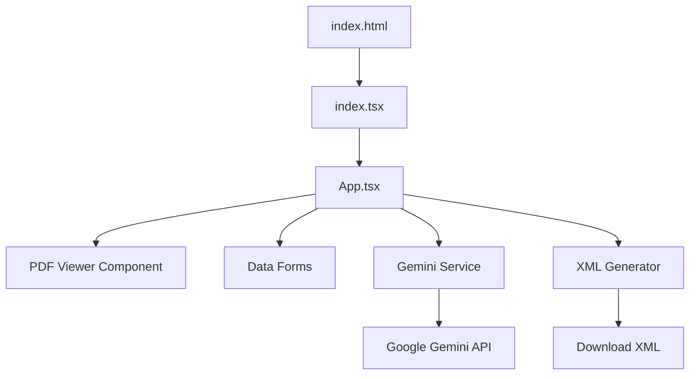

# Digital Reference Material Generator (DRMD)

A React-based web application that leverages **Google's Gemini 2.5 Flash** (Vision) to extract structured data from Reference Material Certificates (PDFs) and generate machine-readable XML documents.

## 🌟 Overview

This tool streamlines the digitization of Reference Material Documents. Instead of manually typing data from certificates into XML files, users can:
1.  **Upload** a PDF certificate.
2.  **Analyze** the document using AI to extract text, tables, metadata, and *coordinates*.
3.  **Review** the extracted data in a form with **interactive PDF highlighting**.
4.  **Export** a validated XML file compliant with Digital Reference Material standards (including D-SI units).

## 🔄 Detailed Workflow Architecture

This project follows a strict linear data flow designed to transform unstructured PDF pixels into structured, schema-compliant XML.

### Phase 1: Document Ingestion
*   **User Action**: The user drags and drops a PDF file (e.g., a Certificate of Analysis) into the application.
*   **Process**: The browser reads the file using the `FileReader` API and converts it into a **Base64 encoded string**.
*   **PDF Rendering**: Simultaneously, `pdf.js` renders the document visually on the left side of the screen, creating a canvas layer that allows for coordinate-based overlays.

### Phase 2: AI-Powered Extraction (Vision)
*   **API Call**: The Base64 image data is sent to the **Google Gemini API** (Model: `gemini-2.5-flash`).
*   **System Instruction**: The model receives a specialized prompt (`services/geminiService.ts`) that defines the strict JSON schema required. It is instructed to:
    *   Identify "Administrative Data" (Producers, Expiry Dates).
    *   Extract "Materials" and "Properties" (Tables of values).
    *   **Crucially**: Return `[page, ymin, xmin, ymax, xmax]` coordinates for every extracted field and section.
*   **Output**: Gemini returns a raw JSON object containing the structured text and the spatial coordinates of where that text is located in the document.

### Phase 3: Intelligent Post-Processing & Normalization
Before the user sees the data, the application cleans and transforms it:
1.  **Unit Conversion (D-SI)**: The app scans all extracted units (e.g., `mg/kg`, `%`, `ppm`). It uses the `utils/unitConverter.ts` engine to map these to **Digital-SI (D-SI)** format (e.g., `\milli\gram\kilogram\tothe{-1}`).
    *   *Rule*: If a unit is `%`, it is converted to `\percent` with a factor of `1` (preserving the visible value).
2.  **Value Parsing**: It splits strings like "4.9 g" into a numerical Value (`4.9`) and a Unit (`g`). If the text is descriptive (e.g., "approx 10ml"), it is flagged as `noQuantity`.
3.  **Date Normalization**: Validity periods like "Valid for 12 months" or "May 2025" are converted into ISO 8601 formats (`P1Y` or `2025-05-31`).

### Phase 4: Interactive Review & Correction (UI)
The user interacts with the split-screen interface:
*   **Visual Highlighting**: When a user focuses on a field (e.g., "Material Name"), the app reads the coordinate metadata for that field. A **red overlay box** is drawn dynamically over the PDF on the left, showing exactly where the AI found that information.
*   **Tabbed Organization**:
    *   **Administrative**: Producer details, validity dates, responsible persons.
    *   **Materials**: Description of the physical item and sample sizes.
    *   **Properties**: Measurement tables (Name, Value, Uncertainty, Unit, k-factor, Probability).
    *   **Comment & Document**: Allows adding general comments and embedding a binary file (PDF/DOCX) directly into the XML.
*   **Manual Override**: The user can correct any AI errors. If "Main Signer" checkboxes need adjusting or values need tweaking, the React state updates instantly.

### Phase 5: Validation
*   **Schema Checks**: The app runs real-time validation against the DRMD/DCC schema rules.
*   **Mandatory Fields**: Fields marked with an asterisk (`*`) (e.g., Name, Value, Unit) are checked.
*   **Feedback**: If data is missing (e.g., no Producer defined), the "Validate & Export" tab shows a detailed error report and prevents export to ensure data integrity.

### Phase 6: XML Serialization & Export
*   **Generation**: Once validated, `utils/xmlGenerator.ts` constructs the final XML string.
*   **Namespaces**: It applies the correct namespaces (`xmlns:dcc`, `xmlns:drmd`, `xmlns:si`).
*   **Binary Embedding**: If a supplementary document was uploaded in Phase 4, it is Base64 encoded and embedded within the `<drmd:document>` tag.
*   **Download**: The browser generates a `.xml` file and triggers a download for the user.

---

## 🚀 Key Features

*   **AI-Powered Extraction**: Uses `gemini-2.5-flash` to visually analyze the PDF structure, extracting nested tables, producer details, and complex validity periods.
*   **Interactive PDF Viewer**:
    *   **Coordinate Highlighting**: Clicking on a form field (or the "i" icon) draws a red box around the exact location in the PDF where the data was found.
    *   **Text Fallback**: If specific coordinates are missing, it falls back to a smart text search to highlight matches.
*   **Automatic Unit Conversion**: Converts human-readable units (e.g., `mg/kg`, `µm`) into **Digital-SI (D-SI)** machine-readable formats (e.g., `\milli\gram\kilogram\tothe{-1}`).
*   **Validation & Export**: Ensures required fields exist before generating the final XML for Digital Calibration Certificate (DCC) systems.

## 🛠️ Local Development

Follow these steps to run the application locally on your machine using VS Code.

### Prerequisites
*   Node.js (v18 or higher recommended)
*   VS Code

### Installation & Running

1.  **Install Dependencies**:
    Open the terminal in the project root and run:
    ```bash
    npm install
    ```

2.  **Start the Development Server**:
    ```bash
    npm run dev
    ```

3.  **Open in Browser**:
    Click the link shown in the terminal (usually `http://localhost:5173`).

4.  **Add API Key**:
    You will need a Google Gemini API Key. Go to the **Settings** tab in the running app to enter it.

## 📂 Project Structure



### File Breakdown

| File | Type | Description |
| :--- | :--- | :--- |
| **`App.tsx`** | **UI Logic** | The main application controller. It manages the global `DRMD` state, handles file uploads, renders the PDF viewer, and manages the tabs (Admin, Materials, Properties). |
| **`services/geminiService.ts`** | **AI Logic** | Communicates with the Google GenAI SDK. It contains the critical **System Instruction** that tells the model how to parse the PDF, including specific rules for **Coordinate Extraction** (ymin, xmin, etc.) and Table Exclusion logic. |
| **`types.ts`** | **Data Model** | Defines the TypeScript interfaces (`DRMD`, `Producer`, `MeasurementResult`) that mirror the logical structure of a Reference Material Document. |
| **`utils/unitConverter.ts`** | **Utility** | A specialized utility that maps standard units to the D-SI LaTeX-style format required for digital metrology (e.g., converting `%` to factor `1` and unit `\percent`). |
| **`utils/xmlGenerator.ts`** | **Output** | Converts the React state into the final XML string. It handles XML namespaces, valid element nesting, and string escaping. |

## ⚙️ Setup & Usage

1.  **API Key**: You need a valid Google Gemini API Key.
2.  **Launch**: Open the application.
3.  **Settings**: Go to the **Settings** tab and paste your API Key.
4.  **Upload**: Click **Upload PDF** to select a Reference Material Certificate.
5.  **Review**:
    *   Navigate through **Administrative Data**, **Materials**, and **Properties**.
    *   Click the **(i)** icon next to fields to see where the data came from in the PDF.
6.  **Export**: Go to **Validate & Export** to generate the `.xml` file.

## 📏 D-SI Unit Support

The converter supports Platinum/Gold class units from the SmartCom D-SI Guide.

| Input | D-SI Unit | Factor |
| :--- | :--- | :--- |
| `mg/kg` | `\milli\gram\kilogram\tothe{-1}` | `1` |
| `%` | `\percent` | `1` |
| `µm` | `\micro\metre` | `1e-6` |
| `g/cm3` | `\gram\centi\metre\tothe{-3}` | `1` |

---
*Documentation for Digital Reference Material Generator v0.3.0*
